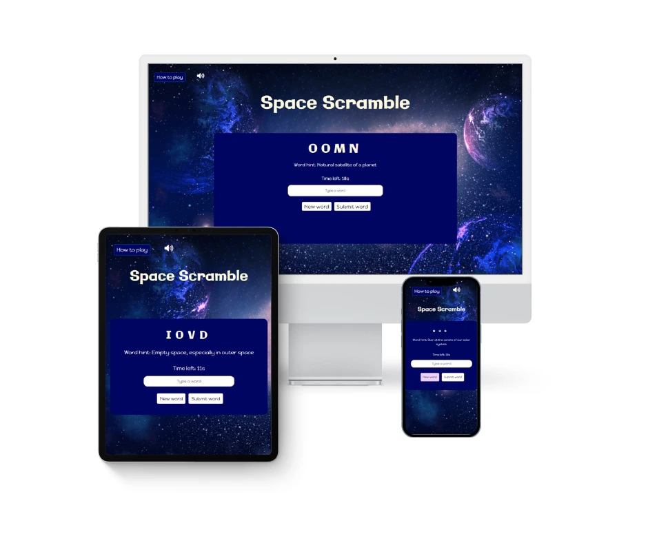
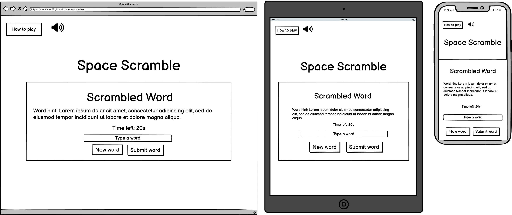
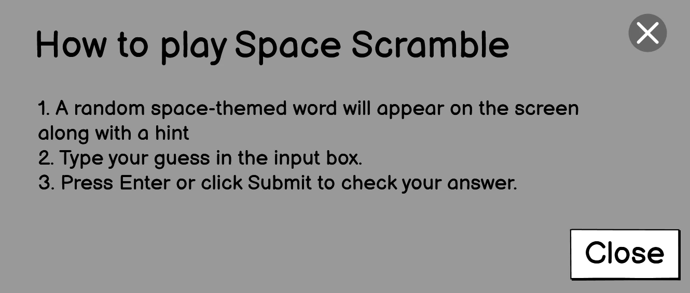

# Milestone Project 2 - Space Scramble

 
 ## Project description
 
 This project is designed for Unit 2: Interactive Front-End Development, where the goal is to create a dynamic web application. For this project, I have developed Space Scramble, a fast-paced word game where players have 20 seconds to unscramble space-themed words of varying difficulty. The game will be designed with a focus on user interaction, leveraging responsive design and real-time gameplay to create an engaging experience for users.
 
 The core focus of this project is to apply the front-end development principles I have learned, demonstrating the ability to build an interactive, functional, and user-friendly web application.
 
 ***
 
 ## User experience (UX)
 
 ### Project Goals
 1. **Create an engaging and interactive experience**: Develop a dynamic, user-friendly word-guessing game that encourages interaction through visual, audio, and responsive elements to enhance engagement.
 
 2. **Establish responsive and accessible design**: Implement a mobile-first approach to ensure the game works seamlessly across desktops, tablets, and mobile devices, while also following web accessibility best practices to make the game inclusive for all users.
 
 3. **Design a visually appealing interface**: Use a structured layout, clear navigation, and thematic UI elements to provide a smooth and enjoyable user experience.
 
 4. **Enhance usability and replayability**: Create a well-balanced difficulty levels and randomised word sets to encourage users to play multiple rounds and stay engaged.
 
 5. **Optimise performance and user flow**: Ensure fast load times, smooth transitions, and efficient content delivery so that players can easily play without delays or frustration.
 
 ### Space Scramble's goals
 
 1. **Create an engaging gameplay experience**: The game will offer a fun and interactive word-guessing challenge that encourages users to play and improve their vocabulary.
 
 2. **Enhance user interaction**: Using a mix of visual, audio, and interactive elements, the game will provide an immersive and enjoyable experience.
 
 3. **Encourage replayability**: The game will be designed to keep users engaged and motivated to play multiple rounds through an enjoyable and rewarding experience.

 ### User stories
 |No.|User Story|
 | ------------- | ------------- |
 |1|As a **player**, As a player, I want a visually appealing game page so that I am excited to play the game.   **Task:** Design an engaging homepage which fits the theme.|
 |2|As a **new user**, I want to understand how to play Space Scramble so that I can start playing right away.   **Task:** Create a simple, easy-to-follow steps explaining the game mechanics, and make them accessible any point of the game.|
 |3|As a **mobile user**, I want the game to be fully responsive so that I can play on any device.   **Task:** Ensure the game is optimised for mobile, tablet, and desktop users.|
 |4|As a **player**, I want sound effects so that the game feels more immersive.   **Task:** Add audio for a richer experience.|
 |5|As a **visitor**, I want to easily navigate the website so that I can find the information I need quickly and efficiently.   **Task:** the website has a clear navigation bar with links to key pages.|
 |6|As a **mobile user**, I want the website to be fully responsive so that I can access it seamlessly on any device.   **Task:** Ensure the website displays correctly on different screen sizes and are easy to navigate on mobile and tablet devices.|
 |7|As a **user with accessibility needs**, I want the game to be accessible so that I can play comfortably.   **Task:** Ensure the site passes accessibility tests.|

 ## Design choices
 For Space Scramble, I created a vibrant, engaging design with a galaxy background to enhance the space theme. The colourful, cosmic backdrop adds depth and immerses players in the experience. This design creates a dynamic, fun environment that keeps players engaged.
 
 ### Typography choices
 **Primary Font:** Galindo
 Galindo was selected for headings and scrambled text, providing a bold, futuristic look that fits the space theme and remains highly readable.
 
 **Secondary Font:** Happy Monkey
 Happy Monkey was chosen for paragraph text due to its playful style, which contrasts with the boldness of Galindo while maintaining clarity and readability.
 
 ### Colour palette
 The dark blues and purples, including #3f0676 and #000560, enhance the galactic feel, while light-coloured fonts provide high contrast for improved readability. This colour scheme complements the immersive space atmosphere.

## Wireframes
The wireframes below represent the envisioned layout for the Space Scramble website. They provide a structural foundation for the development, ensuring the site is designed with the user in mind.

### Index page design

### Modal design
