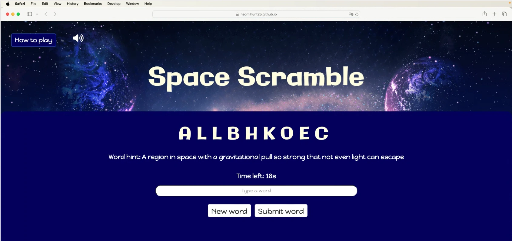

# Milestone Project 2 - Space Scramble

 
 ## Project description
 
 This project is designed for Unit 2: Interactive Front-End Development, where the goal is to create a dynamic web application. For this project, I have developed Space Scramble, a fast-paced word game where players have 20 seconds to unscramble space-themed words of varying difficulty. The game will be designed with a focus on user interaction, leveraging responsive design and real-time gameplay to create an engaging experience for users.
 
 The core focus of this project is to apply the front-end development principles I have learned, demonstrating the ability to build an interactive, functional, and user-friendly web application.
 
 ## User experience (UX)
 
 ### Project Goals
 1. **Create an engaging and interactive experience:** Develop a dynamic, user-friendly word-guessing game that encourages interaction through visual, audio, and responsive elements to enhance engagement.
 
 2. **Establish responsive and accessible design:** Implement a mobile-first approach to ensure the game works seamlessly across desktops, tablets, and mobile devices, while also following web accessibility best practices to make the game inclusive for all users.
 
 3. **Design a visually appealing interface:** Use a structured layout, clear navigation, and thematic UI elements to provide a smooth and enjoyable user experience.
 
 4. **Enhance usability and replayability:** Create a well-balanced difficulty levels and randomised word sets to encourage users to play multiple rounds and stay engaged.
 
 5. **Optimise performance and user flow:** Ensure fast load times, smooth transitions, and efficient content delivery so that players can easily play without delays or frustration.
 
 ### Space Scramble's goals
 
 1. **Create an engaging gameplay experience:** The game will offer a fun and interactive word-guessing challenge that encourages users to play and improve their vocabulary.
 
 2. **Enhance user interaction:** Using a mix of visual, audio, and interactive elements, the game will provide an immersive and enjoyable experience.
 
 3. **Encourage replayability:** The game will be designed to keep users engaged and motivated to play multiple rounds through an enjoyable and rewarding experience.

 ### User stories
 |No.|User Story|
 | ------------- | ------------- |
 |1|As a **player**, As a player, I want a visually appealing game page so that I am excited to play the game.   **Task:** Design an engaging homepage which fits the theme.|
 |2|As a **new user**, I want to understand how to play Space Scramble so that I can start playing right away.   **Task:** Create a simple, easy-to-follow steps explaining the game mechanics, and make them accessible any point of the game.|
 |3|As a **mobile user**, I want the game to be fully responsive so that I can play on any device.   **Task:** Ensure the game is optimised for mobile, tablet, and desktop users.|
 |4|As a **player**, I want sound effects so that the game feels more immersive.   **Task:** Add audio for a richer experience.|
 |5|As a **mobile user**, I want the website to be fully responsive so that I can access it seamlessly on any device.   **Task:** Ensure the website displays correctly on different screen sizes and are easy to navigate on mobile and tablet devices.|
 |6|As a **user with accessibility needs**, I want the game to be accessible so that I can play comfortably.   **Task:** Ensure the site passes accessibility tests.|

 ## Design choices
 For Space Scramble, I created a vibrant, engaging design with a galaxy background to enhance the space theme. The colourful, cosmic backdrop adds depth and immerses players in the experience. This design creates a dynamic, fun environment that keeps players engaged.
 
 ### Typography choices
 **Primary Font:** Galindo
 Galindo was selected for headings and scrambled text, providing a bold, futuristic look that fits the space theme and remains highly readable.
 
 **Secondary Font:** Happy Monkey
 Happy Monkey was chosen for paragraph text due to its playful style, which contrasts with the boldness of Galindo while maintaining clarity and readability.
 
 ### Colour palette
 The dark blues and purples, including #3f0676 and #000560, enhance the galactic feel, while light-coloured fonts provide high contrast for improved readability. This colour scheme complements the immersive space atmosphere.

## Wireframes
The wireframes below represent the envisioned layout for the Space Scramble website. They provide a structural foundation for the development, ensuring the site is designed with the user in mind.

### Index page design

### Modal design

## Features
### Home page
The home page serves as the first point of interaction for users, designed to be engaging, visually appealing, and informative (User stories 1 and 5):

- Visually engaging design: The homepage is designed with a space-themed aesthetic to attract and excite players (User Story 1).
- Responsive layout: The page is optimised for desktop, tablet, and mobile users, ensuring a seamless experience across devices (User Story 5).
 

### Game 
The game page serves as the interactive area where players can engage with the game mechanics (User stories 2, 3, and 6):

- **Clear game instructions:** Simple, easy-to-follow steps explain how to play the game, available at any point of the game for new users to refer to (User Story 2).
- **Responsive gameplay:** The game layout adjusts for mobile, tablet, and desktop users, ensuring it is playable across all devices (User Story 3).
- **Accessible features:** The game includes accessible font sizes, color contrasts, and keyboard navigation to cater to users with various accessibility needs (User Story 6).
 

### Background music
To enhance the user experience, the game includes space-themed background music (User story 4).  
 

### 404 Error Page
The 404 error page provides a helpful, user-friendly experience when users navigate to an invalid page.

- **Error message:** A clear and simple message tells the user they have encountered a broken link or non-existent page and automatically return to the homepage.
 

 ## User Testing

### User Stories Testing  
Each user story was carefully tested to ensure that the Space Scramble game and website meet the expectations of users. The following table summarizes the user stories, their testing outcomes, and the supporting evidence of successful implementation.

| No. | User Story | Pass/Fail | Evidence |
| --- | ---------- | --------- | -------- |
| 1 | As a **player**, I want a visually appealing game page so that I am excited to play the game. | Pass | The homepage is designed with a vibrant space theme that engages users right from the start. The design elements like cosmic backgrounds and dynamic UI components are visually striking and exciting to interact with. |
| 2 | As a **new user**, I want to understand how to play Space Scramble so that I can start playing right away. | Pass | Simple, easy-to-follow instructions are accessible at any point during the game, providing a clear explanation of the gameplay mechanics and how to interact with the game. |
| 3 | As a **mobile user**, I want the game to be fully responsive so that I can play on any device. | Pass | The game adapts seamlessly to all devices, ensuring that the layout and functionality are optimised for mobile, tablet, and desktop use without any issues. |
| 4 | As a **player**, I want sound effects so that the game feels more immersive. | Pass | Background audio was added, making the gameplay more immersive and interactive. |
| 5 | As a **mobile user**, I want the website to be fully responsive so that I can access it seamlessly on any device. | Pass | The website layout automatically adjusts to all screen sizes, ensuring a smooth and consistent experience on mobile, tablet, and desktop devices. The navigation remains user-friendly across all platforms. |
| 6 | As a **user** with accessibility needs, I want the game to be accessible so that I can play comfortably. | Pass | The game follows accessibility best practices, including high contrast, larger font sizes, and keyboard navigation. The site passes accessibility tests, ensuring users with visual or mobility impairments can comfortably engage with the game. |

### Testing Feedback  
The testing phase validated that the game and website are both functional and accessible for all users. 

Here is some additional feedback from the physical testing process by users:
- Enhancing audio options, such as volume control or different sound themes, to cater to more diverse user preferences.
- Add a score system to keep tabs of progress.
- Could add difficulty level button

### Validator testing
- **HTML**
    - Index page: No errors were returned when passing through the official W3C validator  https://validator.w3.org/nu/?doc=https%3A%2F%2Fnaomihunt25.github.io%2Fspace-scramble%2Findex.html
    - 404 page: No errors were returned when passing through the official W3C validator  https://validator.w3.org/nu/?doc=https%3A%2F%2Fnaomihunt25.github.io%2Fspace-scramble%2F404
- **CSS**
    - No issues were found after validating through the official Jigsaw validator  https://jigsaw.w3.org/css-validator/validator?uri=https%3A%2F%2Fnaomihunt25.github.io%2Fspace-scramble%2Fassets%2Fcss%2Fstyle.css&profile=css3svg&usermedium=all&warning=1&vextwarning=&lang=en

### Accessibility testing
I used Lighthouse within the Google DevTools to review the colours and fonts used. Additionally, Lighthouse provides insights into other key areas like Performance, SEO, and Best Practices.  

### Manual testing
- I performed cross-browser testing to ensure the website operates smoothly on various browsers.
- The site was tested on different screen sizes to verify it adapts well, maintaining both its design and functionality across devices.
- The text and fonts were reviewed for clarity and readability to provide an optimal user experience.  

Below are some screenshots demonstrating how the site looks on different devices.

### Desktop
|Chrome 131|Safari 18.3|Firefox 133.0|
| ------------- | ------------- | ------------- |
||||

### Mobile and tablet
|Mobile - Safari iOS 18.3|
| ------------- |
||

|Android mobile - Chrome 131|
| ------------- | 
||

|Tablet - Safari iOS 18.3|
| ------------- | 
||

### Deployment
**GitHub Pages**  
The website is hosted on GitHub Pages. To deploy it, follow these steps:
1. Create an account on [Gitpod](https://gitpod.io/).
2. Install the Gitpod browser extension.
3. Go to the *Settings* tab in the [naomihunt25/space-scramble repository](https://github.com/naomihunt25/space-scramble) on GitHub.
4. In the left sidebar, click *Pages* under the code and automation section.
5. Under *Branch*, select "main" and click *Save*.
6. After saving, the page will display a link under the deployment section in the [naomihunt25/space-scramble repository](https://github.com/naomihunt25/space-scramble). Click the *github-pages* link.
7. The Deployment page will show the live site URL. Click on the link to view the deployed website.

**Fork**  
To fork the repository:
1. On [Gitpod](https://gitpod.io/), go to the [naomihunt25/space-scramble repository](https://github.com/naomihunt25/space-scramble).
2. Click the *Fork* button at the top-right of the page.
3. Add a description for your fork.
4. Click *Create Fork* to finish the process.

**Clone**  
To clone the repository:
1. On the [naomihunt25/space-scramble repository](https://github.com/naomihunt25/space-scramble), click the *Code* button above the list of files.
2. Copy the repository URL.
3. Open your terminal and navigate to the directory where you want to clone the project.
4. Run `git clone` followed by the copied URL.
5. Press enter to clone the repository.

Live link - [Space Scramble](https://naomihunt25.github.io/space-scramble/)

### Credits
#### Content
- I used [Bootstrap](https://getbootstrap.com/) v5.3 to create key elements within the site including the auto-play slideshow, buttons and form
- To ensure a thorough understanding of HTML and CSS code I wasn't confident with before implementation, I referred to [W3Schools](https://www.w3schools.com/) for guidance

### Colour palette
- I utilised [ColorSpace](https://mycolor.space/?hex=%233F0676&sub=1) to get inspirationfor the colour palette for the site

### Fonts
- I used [Fontjoy](https://fontjoy.com/) to find my primary and secondary font
- The primary and secondary font were sourced from [Google Fonts](https://fonts.google.com/)

### Media
#### Icons
- Mute and unmute icons were taken from [Font Awesome](https://fontawesome.com/)
- Personalised favicon were generated by [favicon.io](https://favicon.io/)

#### Images and Audio
- The background image was sourced from [Canva](https://www.Canva.com/)
- Background area was created by Nemeti_Tivdar and sources from [Pixabay](https://pixabay.com/music/supernatural-space-message-113176/)
- I created wireframes using the [Balsamiq](https://balsamiq.com/) software